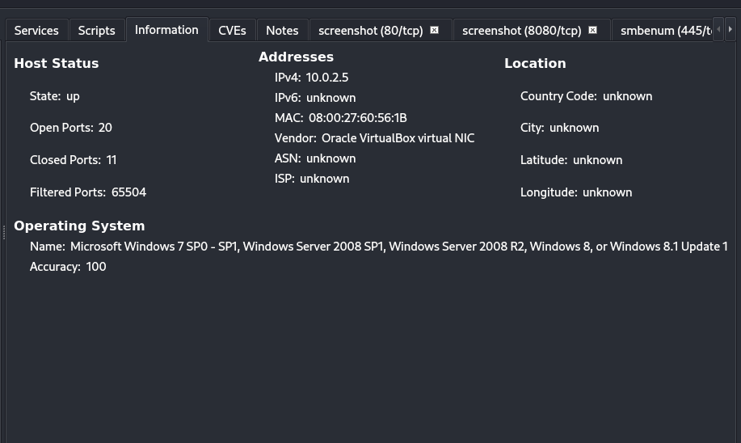
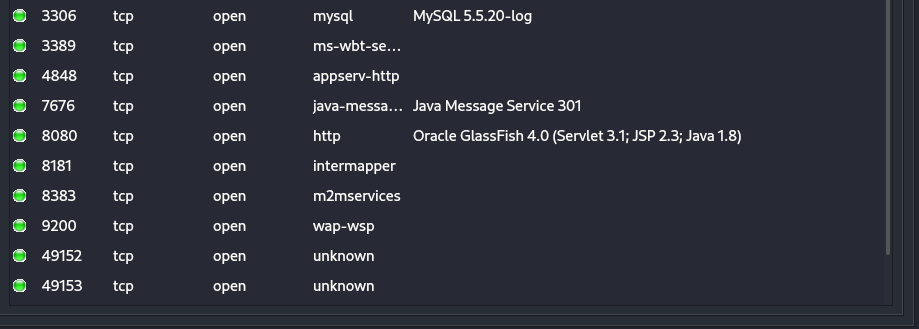
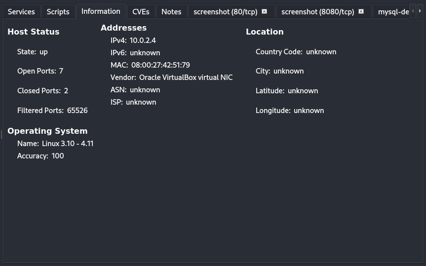
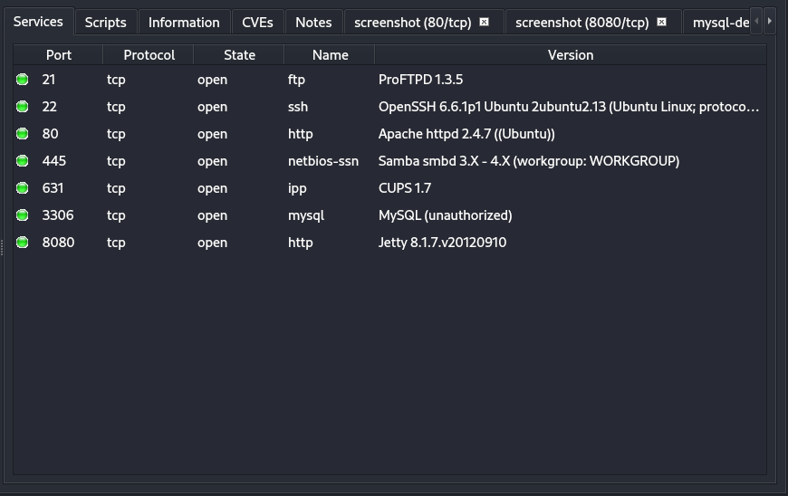
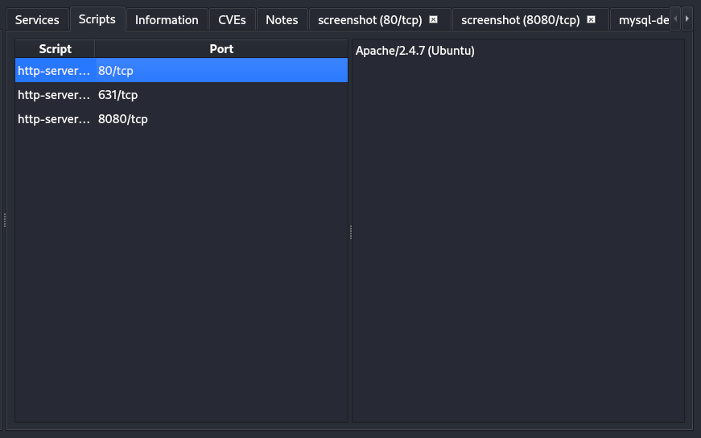
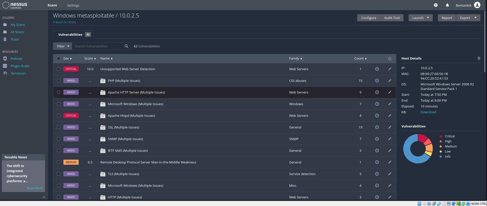
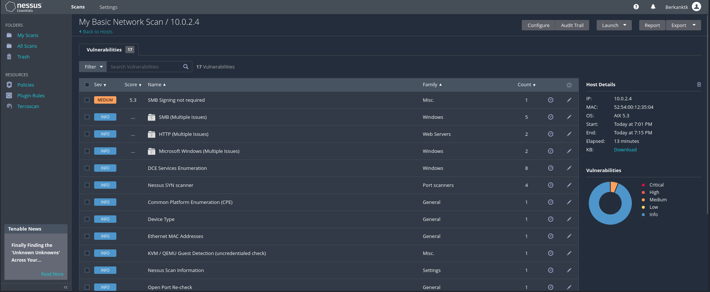

# Exercises

In this lab you will perform steps of an assessment:
* Gather Information: e.g., about a company, range of IP addresses, etc.
* Scan IP addresses: e.g., what services are running on the associated IP addresses
* Fingerprinting: e.g., what web servers, accounts, etc.
* Reporting: summarise the gathered intel

# Preconditions: Installed VMs
* [x] Linux Metasploitable3
* [x] Windows Metasploitable3

# Finding information with whois
**Try whois on the \emph{IP address} of www.sdu.dk .**  
We start by gathering the ip with the `dig` command

```console
berkankutuk@kali:~$ dig sdu.dk
; <<>> DiG 9.10.6 <<>> sdu.dk
;; global options: +cmd
;; Got answer:
;; ->>HEADER<<- opcode: QUERY, status: NOERROR, id: 43946
;; flags: qr rd ra; QUERY: 1, ANSWER: 1, AUTHORITY: 0, ADDITIONAL: 1

;; OPT PSEUDOSECTION:
; EDNS: version: 0, flags:; udp: 1220
;; QUESTION SECTION:
;sdu.dk.				IN	A

;; ANSWER SECTION:
sdu.dk.			747	IN	A	89.188.87.235

;; Query time: 56 msec
;; SERVER: 1.1.1.1#53(1.1.1.1)
;; WHEN: Mon Sep 26 14:35:07 CEST 2022
;; MSG SIZE  rcvd: 51
```

Then we use the `whois` command with the IP we got
```console
berkankutuk@kali:~$ whois 89.188.87.235
Domain:               sdu.dk
DNS:                  sdu.dk
Registered:           1997-10-09
Expires:              2023-12-31
Registration period:  5 years
VID:                  no
DNSSEC:               Signed delegation
Status:               Active

Registrant
Handle:               ***N/A***
Name:                 Syddansk Universitet (University of Southern Denmark)
Address:              Campusvej 55
Postalcode:           5230
City:                 Odense M
Country:              DK

Nameservers
Hostname:             ns1.sdu.dk
Hostname:             ns2.sdu.dk
Hostname:             ns3.sdu.dk
```

**†What do you learn about SDU’s network? In the protocol, note the IP
range.**  
Not much? 


**Are there other Networking-Services @SDU which you could try?**  
Yup

**†What is the whois information for nextcloud.sdu.dk ? What do you observe
in comparison to the whois-information you gathered for www.sdu.dk.**  
We do the same procedure as before
```console
berkankutuk@kali:~$ dig nextcloud.sdu.dk
; <<>> DiG 9.10.6 <<>> nextcloud.sdu.dk
;; global options: +cmd
;; Got answer:
;; ->>HEADER<<- opcode: QUERY, status: NOERROR, id: 15608
;; flags: qr rd ra; QUERY: 1, ANSWER: 1, AUTHORITY: 0, ADDITIONAL: 1

;; OPT PSEUDOSECTION:
; EDNS: version: 0, flags:; udp: 1220
;; QUESTION SECTION:
;nextcloud.sdu.dk.		IN	A

;; ANSWER SECTION:
nextcloud.sdu.dk.	11737	IN	A	130.225.156.61

;; Query time: 51 msec
;; SERVER: 1.1.1.1#53(1.1.1.1)
;; WHEN: Mon Sep 26 14:38:38 CEST 2022
;; MSG SIZE  rcvd: 61
```

And now the whois lookup

```console
berkankutuk@kali:~$ whois 130.225.156.61
% IANA WHOIS server
% for more information on IANA, visit http://www.iana.org
% This query returned 1 object

refer:        whois.arin.net

inetnum:      130.0.0.0 - 130.255.255.255
organisation: Administered by ARIN
status:       LEGACY

whois:        whois.arin.net

changed:      1993-05
source:       IANA

# whois.arin.net

NetRange:       130.225.0.0 - 130.244.255.255
CIDR:           130.225.0.0/16, 130.228.0.0/14, 130.226.0.0/15, 130.244.0.0/16, 130.240.0.0/14, 130.232.0.0/13
NetName:        RIPE-ERX-130-225-0-0
NetHandle:      NET-130-225-0-0-1
Parent:         NET130 (NET-130-0-0-0-0)
NetType:        Early Registrations, Transferred to RIPE NCC
OriginAS:
Organization:   RIPE Network Coordination Centre (RIPE)
RegDate:        2003-11-12
Updated:        2003-11-12
Comment:        These addresses have been further assigned to users in
Comment:        the RIPE NCC region.  Contact information can be found in
Comment:        the RIPE database at http://www.ripe.net/whois
Ref:            https://rdap.arin.net/registry/ip/130.225.0.0

ResourceLink:  https://apps.db.ripe.net/search/query.html
ResourceLink:  whois.ripe.net


OrgName:        RIPE Network Coordination Centre
OrgId:          RIPE
Address:        P.O. Box 10096
City:           Amsterdam
StateProv:
PostalCode:     1001EB
Country:        NL
RegDate:
Updated:        2013-07-29
Ref:            https://rdap.arin.net/registry/entity/RIPE

ReferralServer:  whois://whois.ripe.net
ResourceLink:  https://apps.db.ripe.net/search/query.html

OrgAbuseHandle: ABUSE3850-ARIN
OrgAbuseName:   Abuse Contact
OrgAbusePhone:  +31205354444
OrgAbuseEmail:  abuse@ripe.net
OrgAbuseRef:    https://rdap.arin.net/registry/entity/ABUSE3850-ARIN

OrgTechHandle: RNO29-ARIN
OrgTechName:   RIPE NCC Operations
OrgTechPhone:  +31 20 535 4444
OrgTechEmail:  hostmaster@ripe.net
OrgTechRef:    https://rdap.arin.net/registry/entity/RNO29-ARIN


# whois.ripe.net

inetnum:        130.225.128.0 - 130.225.159.255
netname:        SDU-v4-POOL-01
country:        DK
geofeed:        https://info.net.deic.dk/deic-geofeed.csv
org:            ORG-SUI1-RIPE
admin-c:        UN61-RIPE
tech-c:         UN61-RIPE
status:         ASSIGNED PA
remarks:        Generated by DeiC on 2022-07-28 for more information contact netdrift@deic.dk
mnt-by:         DEIC-MNT
mnt-by:         AS1835-MNT
created:        2015-12-10T10:05:14Z
last-modified:  2022-07-28T11:50:21Z
source:         RIPE

organisation:   ORG-SUI1-RIPE
org-name:       Syddansk Universitet, IT-service
org-type:       other
address:        Campusvej 55
address:        5230 Odense M
address:        DK
mnt-ref:        AS1835-MNT
mnt-by:         AS1835-MNT
mnt-by:         DEIC-MNT
created:        2012-05-03T10:51:17Z
last-modified:  2022-01-28T14:00:25Z
source:         RIPE # Filtered

role:           DeiC Netdrift
address:        DeiC
address:        DTU Building 304
address:        2800 Lyngby
address:        Denmark
phone:          +45 35 888 222
fax-no:         +45 35 888 201
admin-c:        AMD2-RIPE
tech-c:         AMD2-RIPE
tech-c:         JF6044-RIPE
tech-c:         HUB10-RIPE
nic-hdl:        UN61-RIPE
mnt-by:         AS1835-MNT
mnt-by:         DEIC-MNT
created:        2008-11-24T13:12:55Z
last-modified:  2022-01-28T14:00:26Z
source:         RIPE # Filtered
abuse-mailbox:  abuse@cert.dk

% Information related to '130.225.0.0/16AS1835'

route:          130.225.0.0/16
descr:          Forskningsnettet-130.225
origin:         AS1835
mnt-by:         AS1835-MNT
mnt-by:         DEIC-MNT
created:        1970-01-01T00:00:00Z
last-modified:  2022-01-28T14:00:18Z
source:         RIPE

% This query was served by the RIPE Database Query Service version 1.103 (WAGYU)
```

Well we got a lot more information, but there is not much to compare.

# Question: nmap
Nmap scans can be set up to evade firewalls. Which tags would you use for:
* †Send packets with specified ip options
  * `--ip-options <options>`
* †Spoof your MAC address
  * `--spoof-mac` 

# Scanning the Metasploitable VMs
Use Nmap, to scan and find out information about Metasploitable-3, both Windows and Ubuntu. 
In your use of Nmap compare your SYN scan vs the Connect scan vs the scan with the tag that enables OS detection, version detection, script scanning.  
Take notes of the results for all three and discuss differences and pros and cons based on your observation.

**Nmap flags**  
Syn scan = `-sS`  
Connect scan = `-sT`    
OS and version detection = `-O -sV`

## Linux
### Syn scan 
```console
berkankutuk@kali:~$ nmap -sS 10.0.2.4 
Starting Nmap 7.92 ( https://nmap.org ) at 2022-09-26 00:39 CEST
Nmap scan report for 10.0.2.4
Host is up (0.00069s latency).
Not shown: 991 filtered tcp ports (no-response)
PORT     STATE  SERVICE
21/tcp   open   ftp
22/tcp   open   ssh
80/tcp   open   http
445/tcp  open   microsoft-ds
631/tcp  open   ipp
3000/tcp closed ppp
3306/tcp open   mysql
8080/tcp open   http-proxy
8181/tcp closed intermapper
MAC Address: 08:00:27:42:51:79 (Oracle VirtualBox virtual NIC)

Nmap done: 1 IP address (1 host up) scanned in 4.94 seconds
```

### Connect scan
```console
berkankutuk@kali:~$ nmap -sT 10.0.2.4 
Starting Nmap 7.92 ( https://nmap.org ) at 2022-09-26 00:46 CEST
Nmap scan report for 10.0.2.4
Host is up (0.0011s latency).
Not shown: 991 filtered tcp ports (no-response)
PORT     STATE  SERVICE
21/tcp   open   ftp
22/tcp   open   ssh
80/tcp   open   http
445/tcp  open   microsoft-ds
631/tcp  open   ipp
3000/tcp closed ppp
3306/tcp open   mysql
8080/tcp open   http-proxy
8181/tcp closed intermapper
MAC Address: 08:00:27:42:51:79 (Oracle VirtualBox virtual NIC)

Nmap done: 1 IP address (1 host up) scanned in 4.86 seconds
```

### OS and version detection
```console
berkankutuk@kali:~$ nmap -O -sV 10.0.2.4 
Starting Nmap 7.92 ( https://nmap.org ) at 2022-09-26 00:51 CEST
Nmap scan report for 10.0.2.4
Host is up (0.0010s latency).
Not shown: 991 filtered tcp ports (no-response)
PORT     STATE  SERVICE     VERSION
21/tcp   open   ftp         ProFTPD 1.3.5
22/tcp   open   ssh         OpenSSH 6.6.1p1 Ubuntu 2ubuntu2.13 (Ubuntu Linux; protocol 2.0)
80/tcp   open   http        Apache httpd 2.4.7 ((Ubuntu))
445/tcp  open   netbios-ssn Samba smbd 3.X - 4.X (workgroup: WORKGROUP)
631/tcp  open   ipp         CUPS 1.7
3000/tcp closed ppp
3306/tcp open   mysql       MySQL (unauthorized)
8080/tcp open   http        Jetty 8.1.7.v20120910
8181/tcp closed intermapper
MAC Address: 08:00:27:42:51:79 (Oracle VirtualBox virtual NIC)
Device type: general purpose
Running: Linux 3.X|4.X
OS CPE: cpe:/o:linux:linux_kernel:3 cpe:/o:linux:linux_kernel:4
OS details: Linux 3.2 - 4.9
Network Distance: 1 hop
Service Info: Host: UBUNTU; OSs: Unix, Linux; CPE: cpe:/o:linux:linux_kernel

Nmap done: 1 IP address (1 host up) scanned in 12.99 seconds
```

## Windows
### Syn scan 
```console
berkankutuk@kali:~$ nmap -sS 10.0.2.5 
Starting Nmap 7.92 ( https://nmap.org ) at 2022-09-26 01:09 CEST
Nmap scan report for 10.0.2.5
Host is up (0.00086s latency).
Not shown: 982 closed tcp ports (reset)
PORT      STATE SERVICE
21/tcp    open  ftp
22/tcp    open  ssh
80/tcp    open  http
135/tcp   open  msrpc
139/tcp   open  netbios-ssn
445/tcp   open  microsoft-ds
3306/tcp  open  mysql
3389/tcp  open  ms-wbt-server
4848/tcp  open  appserv-http
7676/tcp  open  imqbrokerd
8080/tcp  open  http-proxy
8181/tcp  open  intermapper
8383/tcp  open  m2mservices
9200/tcp  open  wap-wsp
49152/tcp open  unknown
49153/tcp open  unknown
49154/tcp open  unknown
49155/tcp open  unknown
MAC Address: 08:00:27:60:56:1B (Oracle VirtualBox virtual NIC)

Nmap done: 1 IP address (1 host up) scanned in 1.55 seconds
```

### Connect scan
```console
berkankutuk@kali:~$ nmap -sT 10.0.2.5 
Starting Nmap 7.92 ( https://nmap.org ) at 2022-09-26 01:07 CEST
Nmap scan report for 10.0.2.5
Host is up (0.0015s latency).
Not shown: 982 closed tcp ports (conn-refused)
PORT      STATE SERVICE
21/tcp    open  ftp
22/tcp    open  ssh
80/tcp    open  http
135/tcp   open  msrpc
139/tcp   open  netbios-ssn
445/tcp   open  microsoft-ds
3306/tcp  open  mysql
3389/tcp  open  ms-wbt-server
4848/tcp  open  appserv-http
7676/tcp  open  imqbrokerd
8080/tcp  open  http-proxy
8181/tcp  open  intermapper
8383/tcp  open  m2mservices
9200/tcp  open  wap-wsp
49152/tcp open  unknown
49153/tcp open  unknown
49154/tcp open  unknown
49155/tcp open  unknown
MAC Address: 08:00:27:60:56:1B (Oracle VirtualBox virtual NIC)

Nmap done: 1 IP address (1 host up) scanned in 6.80 seconds
```

### OS and version detection
```console
berkankutuk@kali:~$ nmap -O -sV 10.0.2.5 
Starting Nmap 7.92 ( https://nmap.org ) at 2022-09-26 01:09 CEST
Nmap scan report for 10.0.2.5
Host is up (0.0016s latency).
Not shown: 982 closed tcp ports (reset)
PORT      STATE SERVICE              VERSION
21/tcp    open  ftp                  Microsoft ftpd
22/tcp    open  ssh                  OpenSSH 7.1 (protocol 2.0)
80/tcp    open  http                 Microsoft IIS httpd 7.5
135/tcp   open  msrpc                Microsoft Windows RPC
139/tcp   open  netbios-ssn          Microsoft Windows netbios-ssn
445/tcp   open  microsoft-ds         Microsoft Windows Server 2008 R2 - 2012 microsoft-ds
3306/tcp  open  mysql                MySQL 5.5.20-log
3389/tcp  open  ms-wbt-server?
4848/tcp  open  ssl/http             Oracle Glassfish Application Server
7676/tcp  open  java-message-service Java Message Service 301
8080/tcp  open  http                 Sun GlassFish Open Source Edition  4.0
8181/tcp  open  ssl/intermapper?
8383/tcp  open  http                 Apache httpd
9200/tcp  open  wap-wsp?
49152/tcp open  msrpc                Microsoft Windows RPC
49153/tcp open  msrpc                Microsoft Windows RPC
49154/tcp open  msrpc                Microsoft Windows RPC
49155/tcp open  msrpc                Microsoft Windows RPC
2 services unrecognized despite returning data. If you know the service/version, please submit the following fingerprints at https://nmap.org/cgi-bin/submit.cgi?new-service :
==============NEXT SERVICE FINGERPRINT (SUBMIT INDIVIDUALLY)==============
SF-Port8181-TCP:V=7.92%T=SSL%I=7%D=9/26%Time=6330DFD3%P=x86_64-pc-linux-gn
SF:u%r(GetRequest,128C,"HTTP/1\.1\x20200\x20OK\r\nDate:\x20Sun,\x2025\x20S
SF:ep\x202022\x2023:10:34\x20GMT\r\nContent-Type:\x20text/html\r\nConnecti
SF:on:\x20close\r\nContent-Length:\x204626\r\n\r\n<!DOCTYPE\x20HTML\x20PUB
SF:LIC\x20\"-//W3C//DTD\x20HTML\x204\.01\x20Transitional//EN\">\n<html\x20
SF:lang=\"en\">\n<!--\nDO\x20NOT\x20ALTER\x20OR\x20REMOVE\x20COPYRIGHT\x20
SF:NOTICES\x20OR\x20THIS\x20HEADER\.\n\nCopyright\x20\(c\)\x202010,\x20201
SF:3\x20Oracle\x20and/or\x20its\x20affiliates\.\x20All\x20rights\x20reserv
SF:ed\.\n\nUse\x20is\x20subject\x20to\x20License\x20Terms\n-->\n<head>\n<s
SF:tyle\x20type=\"text/css\">\n\tbody{margin-top:0}\n\tbody,td,p,div,span,
SF:a,ul,ul\x20li,\x20ol,\x20ol\x20li,\x20ol\x20li\x20b,\x20dl,h1,h2,h3,h4,
SF:h5,h6,li\x20{font-family:geneva,helvetica,arial,\"lucida\x20sans\",sans
SF:-serif;\x20font-size:10pt}\n\th1\x20{font-size:18pt}\n\th2\x20{font-siz
SF:e:14pt}\n\th3\x20{font-size:12pt}\n\tcode,kbd,tt,pre\x20{font-family:mo
SF:naco,courier,\"courier\x20new\";\x20font-size:10pt;}\n\tli\x20{padding-
SF:bottom:\x208px}\n\tp\.copy,\x20p\.copy\x20a\x20{font-family:geneva,helv
SF:etica,arial,\"lucida\x20sans\",sans-serif;\x20font-size:8pt}\n\tp\.copy
SF:\x20{text-align:\x20center}\n\ttable\.grey1,tr\.grey1,td\.g")%r(HTTPOpt
SF:ions,7A,"HTTP/1\.1\x20405\x20Method\x20Not\x20Allowed\r\nAllow:\x20GET\
SF:r\nDate:\x20Sun,\x2025\x20Sep\x202022\x2023:10:34\x20GMT\r\nConnection:
SF:\x20close\r\nContent-Length:\x200\r\n\r\n")%r(RTSPRequest,76,"HTTP/1\.1
SF:\x20505\x20HTTP\x20Version\x20Not\x20Supported\r\nDate:\x20Sun,\x2025\x
SF:20Sep\x202022\x2023:10:34\x20GMT\r\nConnection:\x20close\r\nContent-Len
SF:gth:\x200\r\n\r\n");
==============NEXT SERVICE FINGERPRINT (SUBMIT INDIVIDUALLY)==============
SF-Port9200-TCP:V=7.92%I=7%D=9/26%Time=6330DFC7%P=x86_64-pc-linux-gnu%r(Ge
SF:tRequest,194,"HTTP/1\.0\x20200\x20OK\r\nContent-Type:\x20application/js
SF:on;\x20charset=UTF-8\r\nContent-Length:\x20317\r\n\r\n{\r\n\x20\x20\"st
SF:atus\"\x20:\x20200,\r\n\x20\x20\"name\"\x20:\x20\"Black\x20Tom\x20Cassi
SF:dy\",\r\n\x20\x20\"version\"\x20:\x20{\r\n\x20\x20\x20\x20\"number\"\x2
SF:0:\x20\"1\.1\.1\",\r\n\x20\x20\x20\x20\"build_hash\"\x20:\x20\"f1585f09
SF:6d3f3985e73456debdc1a0745f512bbc\",\r\n\x20\x20\x20\x20\"build_timestam
SF:p\"\x20:\x20\"2014-04-16T14:27:12Z\",\r\n\x20\x20\x20\x20\"build_snapsh
SF:ot\"\x20:\x20false,\r\n\x20\x20\x20\x20\"lucene_version\"\x20:\x20\"4\.
SF:7\"\r\n\x20\x20},\r\n\x20\x20\"tagline\"\x20:\x20\"You\x20Know,\x20for\
SF:x20Search\"\r\n}\n")%r(HTTPOptions,4F,"HTTP/1\.0\x20200\x20OK\r\nConten
SF:t-Type:\x20text/plain;\x20charset=UTF-8\r\nContent-Length:\x200\r\n\r\n
SF:")%r(RTSPRequest,4F,"HTTP/1\.1\x20200\x20OK\r\nContent-Type:\x20text/pl
SF:ain;\x20charset=UTF-8\r\nContent-Length:\x200\r\n\r\n")%r(FourOhFourReq
SF:uest,A9,"HTTP/1\.0\x20400\x20Bad\x20Request\r\nContent-Type:\x20text/pl
SF:ain;\x20charset=UTF-8\r\nContent-Length:\x2080\r\n\r\nNo\x20handler\x20
SF:found\x20for\x20uri\x20\[/nice%20ports%2C/Tri%6Eity\.txt%2ebak\]\x20and
SF:\x20method\x20\[GET\]")%r(SIPOptions,4F,"HTTP/1\.1\x20200\x20OK\r\nCont
SF:ent-Type:\x20text/plain;\x20charset=UTF-8\r\nContent-Length:\x200\r\n\r
SF:\n");
MAC Address: 08:00:27:60:56:1B (Oracle VirtualBox virtual NIC)
Device type: general purpose
Running: Microsoft Windows 7|2008|8.1
OS CPE: cpe:/o:microsoft:windows_7::- cpe:/o:microsoft:windows_7::sp1 cpe:/o:microsoft:windows_server_2008::sp1 cpe:/o:microsoft:windows_server_2008:r2 cpe:/o:microsoft:windows_8 cpe:/o:microsoft:windows_8.1
OS details: Microsoft Windows 7 SP0 - SP1, Windows Server 2008 SP1, Windows Server 2008 R2, Windows 8, or Windows 8.1 Update 1
Network Distance: 1 hop
Service Info: OSs: Windows, Windows Server 2008 R2 - 2012; CPE: cpe:/o:microsoft:windows

Nmap done: 1 IP address (1 host up) scanned in 111.78 seconds
```

## Pros and cons
Pros
* `-sS` is silent
* `-sT` uses the concept of a full three-way handshake to discover whether a given port is open, filtered, or closed according to the response it receives  
* `-O -sV` gives a lot more valuable information about the OS and version numbers of the used services

Cons
* `-sT` is loud and is definitely discovered
* `-O -sV` can lots of data that isn't necessary

# Scanning with Legion
## Windows





## Linux





# Scanning with Nessus / GVM
Nessus was chosen for both Metasploitable images.

## Windows
See the Nessus Windows report [here](../Lab03-Assessment/Nessus-reports/Windows-metasploitable.pdf).


## Linux
See the Nessus Ubuntu report [here](../Lab03-Assessment/Nessus-reports/Linux-metasploitable.pdf).


# Comparing the tools
## Nmap VS Legion VS Nessus
Nmap is a simple network exploration tool whereas Legion is a semi-automatic network penetration framework. Nmap can 
provide a list of open ports, running services, OS-versions and lots of other network related things. Legion 
provides the same network scanning results as Nmap in a GUI, while also doing directory scans and password guessing 
by trying to bruteforce login forms. Both Nmap and Legion is free of any costs.

Some services the Legion framework provides:  
* Nmap
* Dirbuster
* Nikto
* Hydra
* SMBenum
* And many scheduled scripts

Nessus is a vulnerability scanner tool and is made specially for vulnerability assessments. It uses the CVE 
architecture in order to identify exploits and other vulnerabilities.

### Pros and cons
Nmap

| Pros                     | Cons                                                      |
|--------------------------|-----------------------------------------------------------|
| Fast results             | Misses automatic CVE detection                            |
| Many manual scan options | Results can be unmanageable and in some cases troublesome |
| Can run scripts          |                                                           |

Legion

| Pros                                  | Cons                                                  |
|---------------------------------------|-------------------------------------------------------|
| Runs many services in one             | Lots of old dependecies                               |
| User-friendly config screen           | Can be slow due to running all the different services |
| Lots of scanning options              |                                                       |
| Can run scripts                       |                                                       |
| GUI based                             |                                                       |
| Shows images and websites it collects |                                                       |
| Automatic detection of CVEs           |                                                       |


Nessus
| Pros                                     | Cons                                              |
|------------------------------------------|---------------------------------------------------|
| Intuitive user interface                 | Consumes lots of resources                        |
| Best vulnerability scanner in the market | Can become very slow when scanning large datasets |
| Easy to install and setup                | Professional version is very expensive            |
| Flexible scanning options                |                                                   |
| Provides exportable reports              |                                                   |

# Collecting the Assessment Information
The following section will give an overview of the two metasploitable images, and their vulnerable services. Lastly 
one of the listed services(highest base score) will be described for each of the systems.

## Windows
**Tools and resources used:** Nmap, Legion & Nessus  
**Top 4 vulnerable services** 
1. SSH, port 22, version OpenSSH 7.1
2. HTTP, port 80, version Microsoft IIS httpd 7.5
3. HTTP, port 8080, version Sun GlassFish Open Source Edition  4.0
4. Microsoft-ds, port 445, version Microsoft Windows Server 2008 R2

### Microsoft RDP - Uncredentialed check
**The underlying issue**   
The running Remote Desktop Protocol(RDP) service on the system is vulnerable to a remote code execution.

**What can be achieved?**  
The attacker can exploit this vulnerability by using specially crafted requests which gives the attacker the ability 
to execute arbitrary code on the server.

**How severe is that issue?**  
Critical, base score of 9.8 (CVSS V3).

**Impact for a real system**  
If not updated, a successful exploitation could lead to the attacker installing programs, view, change and even 
delete data on the system. This also gives the attacker a chance to create a new account with full user rights on 
the system.

**How critical you would assess the issue**  
The severity is marked as 5/5 since this exploit requires no user interaction, and gives the attacker the ability to 
remotely execute code.

**Sources**
* [CVE-2019-0708](https://cve.mitre.org/cgi-bin/cvename.cgi?name=CVE-2019-0708)
* [Microsoft RDP RCE.](https://www.tenable.com/plugins/nessus/125313)
* [Customer guidance.](https://support.microsoft.com/en-us/topic/customer-guidance-for-cve-2019-0708-remote-desktop-services-remote-code-execution-vulnerability-may-14-2019-0624e35b-5f5d-6da7-632c-27066a79262e)

## Linux
**Tools and resources used:** Nmap, Legion & Nessus  
**Top 4 vulnerable services**
1. FTP, port 21, version ProFTPD 1.3.5
4. SSH, port 22, version OpenSSH 6.6.1p1
3. SMB, port 445, version Samba smbd 3.X - 4.X
2. IPP, port 631, version CUPS 1.7

### SMB - Signing not required
**The underlying issue**   
The service running on port 445 which is an SMB server are vulnerable to a non-authorized attack.

**What can be achieved?**  
A remote attacker can exploit this vulnerability and thereby conduct a man-in-the-middle attack against the SMB server.

**How severe is that issue?**  
Medium, base score of 5.3 (CVSS V3).

**Impact for a real system**  
When message signing isn't enforced by the host's configuration the outcome on a real server could be a MITM attack 
thereby giving the attacker the ability to relay information.

**How critical you would assess the issue**  
The severity is marked as 2/5 since  this is a configuration error and not a bug.

**Sources** 
- [SMB Signing not required.](https://www.tenable.com/plugins/nessus/57608)
- [smb.conf](https://www.samba.org/samba/docs/current/man-html/smb.conf.5.html)

# Completing the Assessment
**Overall review of the security concerns**  
The Linux metasploitable running Ubuntu has a few but still considerable vulnerabilities that should be mitigated in 
order to improve security and integrity of the system. The windows metasploitable has some major vulnerabilities 
that should be remediated immediately. 

In general both of the systems use old versions of FTP and SSH, which also can lead to unauthorized attacks.

**Different criticality levels of the services**  
Windows


Linux


**Issues for prioritisation**  
The Windows metasploitable image has some critical issues such as using old versions of Apache webservers, PHP and 
Windows DNS clients. Some of these resulting in remote code execution and affecting the overall system integrity.

The Linux metasploitable has some medium to small scale issues, where the first focus should be to enforce the 
security by updating the configuration file for the active SMB server.
