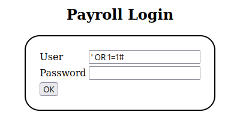
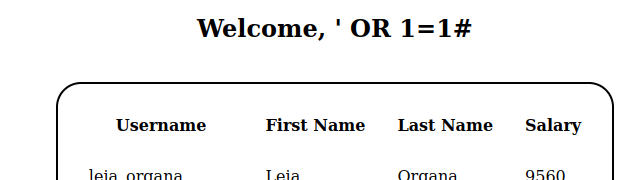
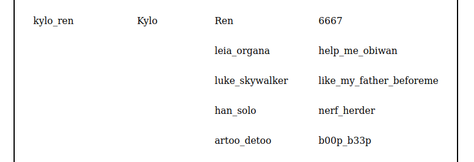

# Exercises
In this lab you will do the following:
* Construct and/or test out SQL injection strings to extract data from a MySQL server.
* Exploit bad local configuration & even worse policies.
* Experiment a bit with toy malware.

# SQL Injection
**Notice that ports for TCP - Hypertext Transfer Protocol (HTTP) and a MySQL Server are
open. What are the port numbers?**  
80 for the HTTP server, 3306 for the mysql server.


**Nessus does say it was unable to get version number for the MySQL server because it is restricted. Reflect on that.**
**†Does it mean the MySQL server is protected against cyber attacks? From Kali, try `mysql -h <METASPLOITABLE IP> -P 
3306` :**  

````console
berkankutuk@kali:~$ mysql -h 10.0.2.4 -P 3306
ERROR 1130 (HY000): Host 'ubuntu' is not allowed to connect to this MySQL server
````
It looks like it is protected against remote access

**†How could that protection look like?**  
?

**†And what exactly would it protect against?**  
See data about the database. (tables etc)

## Spying with SQL Injection
**Try accessing the web server through a browser by just entering the IP number and port number: <IP>:80 and hit enter. 
Notice the fact that we actually get a directory listing. Is this a well configured web server? Let’s go on by 
selecting "payroll_app.php"**    

**Now just press the "OK" button without any input. Notice that the page takes
the empty user name and password as correct input, even though it retrieves
nothing. Can this be good?**  
Fuck yes we're in baby!

Obviously not

**Now press the back button in the browser. Lets try the first SQL injection.Assuming that the text field’s input is 
used directly in a SQL query**  
`' OR 1=1#` seems to work





**†Please shortly discuss your opinion of this web server’s configuration
concerning directly listings.**
Its bad and concerning since the database to the "payroll app?" is vulnerable to SQL injection. The fields are not 
sanitized

**†What type of SQLi attack works? Can you explain why?**  
Boolean-based (content-based) Blind SQLi

**Nmap and Nessus revealed that there is a database on the server on port 3306. What service is running there?**  
mysql

**Let’s go on and try to get all usernames and passwords. Enter the following command into any of the fields `' OR 
1=1 UNION SELECT null,null,username,password FROM users#` :**   



**What do you notice about these passwords? What would you change to secure them?**  
They are in plain text. I would have used hashed and salted values to make every entry unique

**Are these passwords also used for system authentication? Lets find out. Lets try remote login using ssh from the 
terminal in Kali. Enter the following and replace "username" with any of the usernames that you found from the 
SQLinjection, and replace IP with the Metasploitable3’s IP. `ssh username@IP`** 

````console
berkankutuk@kali:~$ ssh chewbacca@10.0.2.4
The authenticity of host '10.0.2.4 (10.0.2.4)' can't be established.
ED25519 key fingerprint is SHA256:Rpy8shmBT8uIqZeMsZCG6N5gHXDNSWQ0tEgSgF7t/SM.
This key is not known by any other names
Are you sure you want to continue connecting (yes/no/[fingerprint])? yes
Warning: Permanently added '10.0.2.4' (ED25519) to the list of known hosts.
chewbacca@10.0.2.4's password: 
Welcome to Ubuntu 14.04 LTS (GNU/Linux 3.13.0-24-generic x86_64)

 * Documentation:  https://help.ubuntu.com/

The programs included with the Ubuntu system are free software;
the exact distribution terms for each program are described in the
individual files in /usr/share/doc/*/copyright.

Ubuntu comes with ABSOLUTELY NO WARRANTY, to the extent permitted by
applicable law.

chewbacca@ubuntu:~$ 
````

**†What is the & sign for?**  
Indicates start of a query string

**†What is the issue with the passwords in the data base and what could be done to secure them?**  
They are in plain text. I would have used hashed and salted values to make every entry unique


**†Which other problem allows you to get into the machine using ssh? How could this be prevented?**  
Not a secure SSH configuration. Iptables, use of another port and stronger passwords could be some options. But best of 
them would be to completely remote the option to login with passwords, and instead use public/private keys for 
authentication.

## Elevation of Privilege
