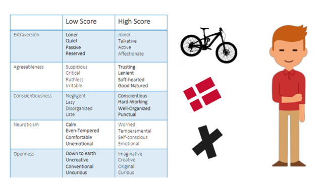

# Exercises
Social engineering plays an important role in a majority of real-worldbreaches. In summary,“Social Engineering is the art of convincing someoneto do something, they normally wouldn’t do, through psychological manipula-tion”. As it targets humans, it poses the danger of bypassing all technologicalsecurity features

# Defense
**†Which technical tools can be used to defend against social engineering attacks and against which?**  
* Principle of least privileges - Zero trust
* Security hardware (Yubikey)
* Digital signature signing to defend against phishing attacks
* Spam filters

**†Give examples on how you, as IT-experts, can either stop or mitigate Social Engineering.**  
* Train employees (lowers the risk)
* Define boundaries between internal and external communication
* Internal testing, where employees deliberately try to perform a social engineering attack on their colleagues.

# Experiment: Attack & Defense
For this exercise, we will have two teams, the attackers and the defenders. In each team, form smaller groups of 2−−4 Social Engineers and Defenders

## The Social Engineers will
**†Tailor an attack based on the information on our fictive victim DAN (see slides),based on the lecture materials. Discuss your choices.**
* Focus points: Loner, Trusting, Soft-Hearted, Unemotional, Uncurious
* Phishing email pretending to be an authoritative figure to exploit his trusting traits.
  * Include a link to a fraudulent website, that pretends to be legit to fool the victim into giving up their personal information and payment card details.
  * Fool the victim into downloading a malicious piece of software, that will grant the attacker access to their personal devices.

## The Defenders will
**†Tailor a course to DAN, to make sure that he is aware of and protected in the best possible way against social engineering attacks. Optionally, you can think about a nice concept on how to do this, but this is not the essential part. Discuss yourchoices.**  
* First introduce him for the risks of liking the social democrats
* Incorporate procedures as
  * Request ID verification from the caller
  * Never click on an email you don’t recognize
* Introduce Principle of least privileges
* Train staff on testing

## Social Engineers and Defenders (regroup)
**†Present your approaches and then discuss if your strategies are matched or if you could strengthen the defence or harden the attack.**  
They are matched because the attackers targeted Dan through his email trying to be pretend an authoritative figure, and by implementing incorporate procedures this attack could potentially be avoided. Even though Dan is a good-hearted person, he must be introduced to zero-trust.
